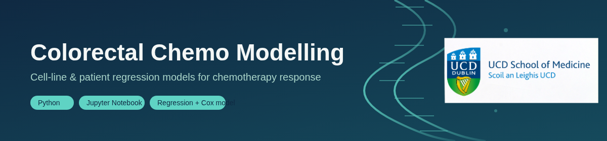

<p align="center">
  
</p>

# Colorectal Chemo Modelling

Can a regression model trained on cancer cell lines predict how real colorectal cancer patients respond to chemotherapy — and does it agree with a survival model trained directly on patient data?

This project builds two models and checks whether they tell the same story:

- **Cell-line → patient direction:** train a regression model on cell-line mutation data to predict chemo sensitivity, then apply it to patient mutation profiles and test whether the predicted score explains survival.
- **Patient → cell-line direction:** fit a Cox regression directly on patient survival data to find which mutations look high-risk, then check whether those same mutations show drug resistance in cell lines.

If both directions agree, that's evidence of a real, consistent biological signal — not just a coincidence in one dataset.

## Project structure

```
colorectal-chemo-modelling/
├── assets/                  # banner, figures, images
├── data/
│   ├── raw/                 # raw downloaded data (not committed)
│   └── processed/           # cleaned/merged feature tables (not committed)
├── models/                  # trained model files (.pt)
├── notebooks/
│   ├── 01_data_preparation.ipynb
│   ├── 02_cellline_regression.ipynb
│   ├── 03_patient_survival_validation.ipynb
│   ├── 04_patient_cox_regression.ipynb
│   └── 05_crossvalidation_summary.ipynb
├── src/                     # shared helper functions used across notebooks
├── requirements.txt
└── README.md
```

## Setup

```bash
git clone <repo-url>
cd colorectal-chemo-modelling
python -m venv venv
source venv/bin/activate        # Windows: venv\Scripts\activate
pip install -r requirements.txt
jupyter notebook
```

## Pipeline

Notebooks are numbered and meant to be run in order.

| Notebook | What it does |
|---|---|
| `01_data_preparation.ipynb` | Load and clean the raw datasets, match identifiers across sources, build the cell-line and patient feature tables |
| `02_cellline_regression.ipynb` | Train a regression model on cell-line mutation data to predict chemo sensitivity → saves `models/cellline_regression_model.pt` |
| `03_patient_survival_validation.ipynb` | Apply the cell-line model to patient data, generate predicted sensitivity scores, fit survival model against real outcomes |
| `04_patient_cox_regression.ipynb` | Fit a Cox regression directly on patient data to derive a patient-side risk signature → saves `models/patient_cox_model.pt` |
| `05_crossvalidation_summary.ipynb` | Compare both directions and pull together final figures |

## Data

Datasets are not yet finalised. `data/raw/` and `data/processed/` are kept empty (with `.gitkeep`) — actual data files should **not** be committed to the repo. Once sources are confirmed, document them here (name, link, what it provides, download date).

## Team

- Caolan — 
- 
- 
